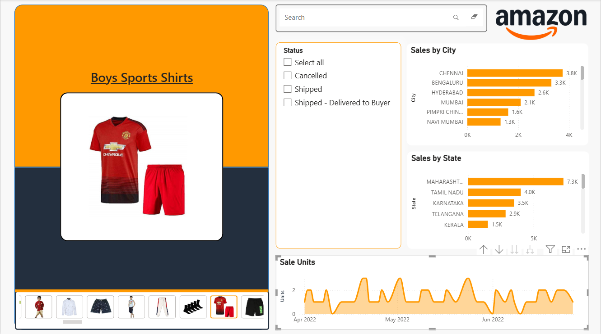
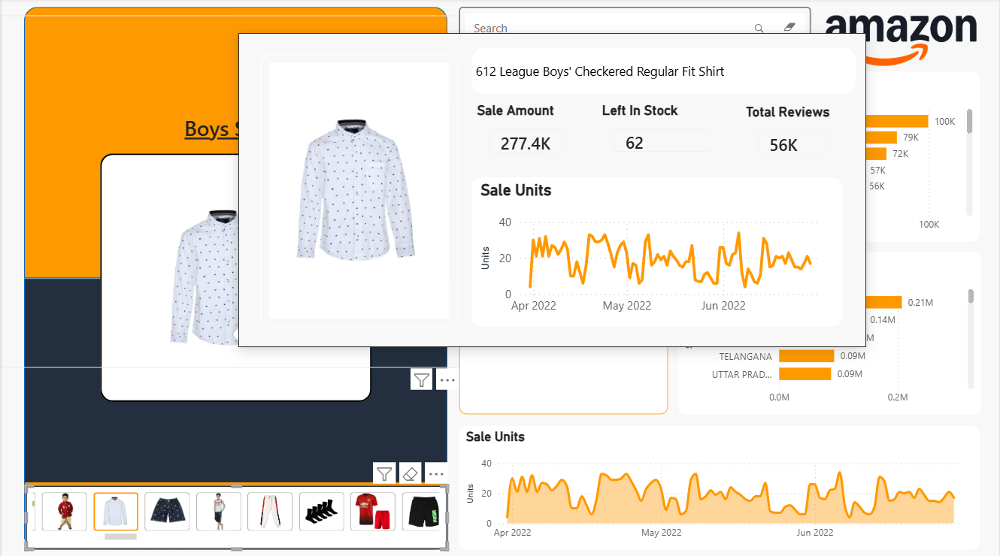

# Amazon Sales Analysis Dashboard 📊

An interactive **Amazon Sales Analysis Dashboard** built using **Microsoft Power BI** to analyze sales performance, order status, product performance, customer reviews, geographic distribution, and sales trends.

The dashboard transforms raw Amazon sales data into meaningful visual insights through interactive charts, slicers, product-level analysis, and dynamic tooltips.

---

## 📌 Project Overview

This project focuses on analyzing Amazon sales data to understand:

- Overall sales performance
- Sales units and quantities
- Product-level performance
- Customer reviews
- Sales by city and state
- Order and shipment status
- Sales trends over time
- Product-specific sales distribution

The dashboard is designed to provide an easy-to-use interface for exploring sales data and identifying important business insights.

---

## 🛠️ Tools & Technologies

- **Microsoft Power BI** – Dashboard development and visualization
- **Power Query** – Data cleaning and transformation
- **DAX** – Measures and calculations
- **Microsoft Excel** – Original data source
- **CSV** – Product dataset
- **Git & GitHub** – Version control and project sharing

---

## 📊 Dashboard Features

### Sales Overview

The dashboard provides an overview of Amazon sales performance through:

- Total sales
- Sales units
- Product performance
- Sales by city
- Sales by state
- Sales trends

### Geographic Analysis

Sales performance can be analyzed across different locations, including:

- Cities
- States

This helps identify regions contributing the most to overall sales.

### Order Status Analysis

Interactive filtering allows analysis of different order statuses, such as:

- Cancelled
- Pending
- Shipped
- Shipped - Damaged
- Shipped - Delivered to Buyer
- Shipped - Lost in Transit
- Shipped - Out for Delivery
- Shipped - Picked Up
- Shipped - Rejected by Buyer
- Shipped - Returned to Seller
- Shipped - Returning to Seller
- Shipping

### Product-Level Analysis

The dashboard includes an interactive product selection experience.

Selecting a product dynamically updates its:

- Product image
- Product name
- Sale amount
- Sale units
- Customer reviews
- Sales trend over time

### Dynamic Product Tooltip

A custom **Power BI Report Page Tooltip** is used to display detailed information about individual products without leaving the main dashboard.

The tooltip includes:

- Product image
- Product name
- Sale amount
- Sale units
- Total reviews
- Product sales trend

---

## 📷 Dashboard Preview

### Main Dashboard



### Product Analysis / Tooltip



---

## 📈 Key Insights

The dashboard can be used to identify:

- Top-performing products
- High-sales cities and states
- Product-level sales trends
- Changes in sales volume over time
- Products with high customer engagement
- Order and shipment patterns

---

## 🧩 Data Model

The Power BI model uses separate tables for product information and sales/order information.

A dedicated **Products** table is used as a dimension table to connect product information with sales data through the `asin` field.

Conceptually:

```text
                    Products
                      asin
                     /    \
                    /      \
                   ↓        ↓
          Amazon-Fashion   Amazon
             Product       Sales
             Details       Data